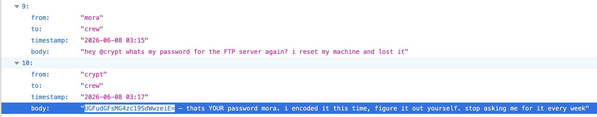
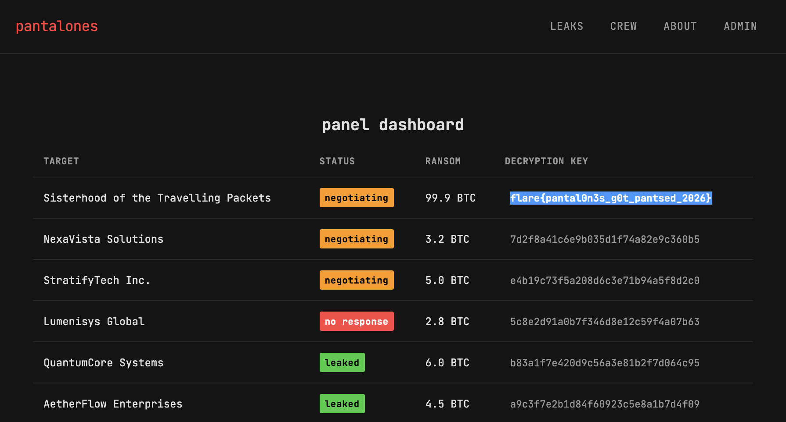

# Sisterhood of the Traveling Packets — CTF Writeup

**Author:** Mandy Chung
**Event:** WiCyS x Flare x SANS — Sisterhood of the Traveling Packets
**Category:** Web / OSINT / Dark Web Recon
**Date Solved:** 17 August 2026
**Difficulty:** Beginner

## Summary

This challenge simulated infiltrating a ransomware collective's dark web leak site, requiring Tor-based reconnaissance, file analysis, directory enumeration, and an API-driven credential-guessing chain to reach the admin panel and retrieve the flag.

## Reconnaissance

I opened the target `.onion` address in Tor Browser:

```
http://b3u42lmdurcyqieiox3o3ns2c2rst6doyyjnwfuirr7bnewt53gke7yd.onion/
```

The site presented itself as a ransomware payment portal listing six victims. Two victims had already reached the end of their countdown timer, and had leaked files available for direct download which is a typical extortion-site layout used to simulate pressure tactics.

## File Analysis

I downloaded the exposed victim files and ran `ls -la` to reveal hidden files not shown by a default listing. This surfaced a hidden script, `.exfil.sh`, which I inspected for clues about the site's internal logic, specifically looking for encoding methods, hardcoded paths, or credential-handling patterns that might hint at how the backend processed data.

```bash
ls -la
cat .exfil.sh
```

The script's contents suggested the operators encoded sensitive values using base64, which became the key lead for a later step.

## Enumeration

Next, I checked `robots.txt` on the main site, which is a standard first move for uncovering disallowed paths not linked from the visible UI:

```
http://<onion-address>/robots.txt
```

This revealed two paths not otherwise linked: `admin.php` and `api.php`, pointing to an authentication panel and a backend API respectively.

## API Exploitation

I tested `api.php` directly to see what the backend exposed. With the hints of `missing required parameter`, I guessed `conversation_id` might be a simple sequential index and tested values `0` through `5`:

```
http://<onion-address>/api.php?action=messages&conversation_id=0
http://<onion-address>/api.php?action=messages&conversation_id=1
http://<onion-address>/api.php?action=messages&conversation_id=2
http://<onion-address>/api.php?action=messages&conversation_id=3
http://<onion-address>/api.php?action=messages&conversation_id=4
http://<onion-address>/api.php?action=messages&conversation_id=5
```

`conversation_id=2` returned a conversation thread containing an encrypted password tied to the user `mora`. This indicated the `messages` action was leaking internal operator communications — including credential material — via an unauthenticated API call, a clear example of an Insecure Direct Object Reference (IDOR) style flaw.



## Decryption

Based on the encoding style observed in `.exfil.sh`, I guessed the encrypted password was base64-encoded rather than hashed or encrypted with a stronger scheme. Decoding it with a standard base64 decode produced a plaintext password:

```bash
echo UGFudGFsMG4zc19SdWwzeiE= | base64 -d
```

## Gaining Access & Flag

Using the recovered credentials (`mora` / decoded password) on the `admin.php` login page granted access to the admin panel, where the flag was displayed directly.

```
Username: mora
Password: Pantal0n3s_Rul3z!%
```



**Flag:** `flare{pantal0n3s_g0t_pantsed_2026}`

## Lessons Learned

- Hidden dotfiles (`.exfil.sh`) are a reminder to always run `ls -la` rather than trusting default file listings, since operational scripts are often left behind carelessly.
- `robots.txt` remains a reliable first step for surfacing unlinked admin/API endpoints even in dark-web-style challenges.
- The `messages` API action lacked access control on `conversation_id`, a textbook IDOR — sequential/guessable IDs on sensitive endpoints should always require authentication and authorization checks.
- Base64 is encoding, not encryption — this challenge reinforced why storing "encrypted" credentials as base64 is a critical OPSEC failure, mirroring real-world ransomware group mistakes that researchers exploit for attribution.
- Systematic, sequential API parameter testing (rather than random guessing) was key to surfacing the leaked credential efficiently.

## Tools Used

Tor Browser, `ls -la`, `base64 -d`, browser DevTools (for API testing).
